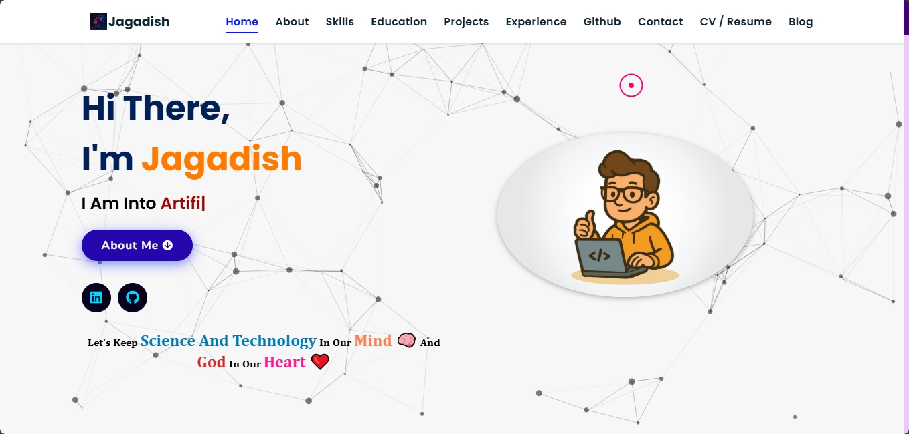
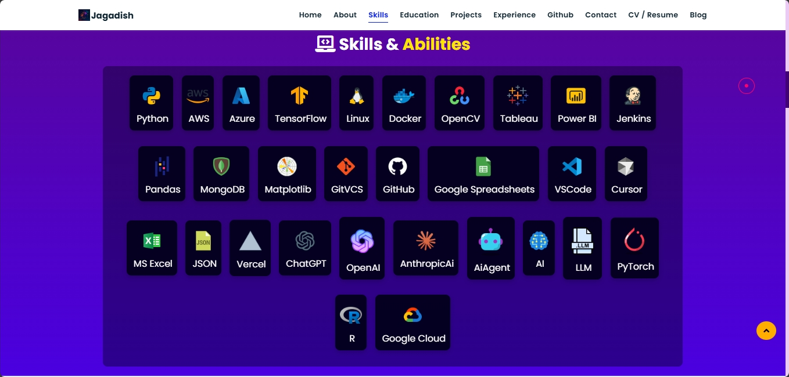

<h1 align="center">🌟 My Portfolio Website 🌟</h1>

This is my personal **Portfolio Website**, designed to showcase my skills, projects, and professional journey.  
It serves as a central hub where visitors can explore my work, learn about my background, and connect with me.


### 🎯 Purpose  
The goal of this portfolio is to present my professional identity in a clean, engaging, and user‑friendly way, while making it easy for potential clients, collaborators, or employers to connect with me.


## Contact

I would love to connect with you and discuss collaboration opportunities or answer any questions you might have. Feel free to reach out to me through the following channels:

- Email: jagadish@engineer.com
- LinkedIn: (www.linkedin.com/in/jagadish-mali)
- Portfolio Website: (https://jcm-ai.github.io)

## 📸 Preview



## 🚀 Setup
**Clone the repository**
```bash
git clone https://github.com/yourusername/portfolio.git
```
